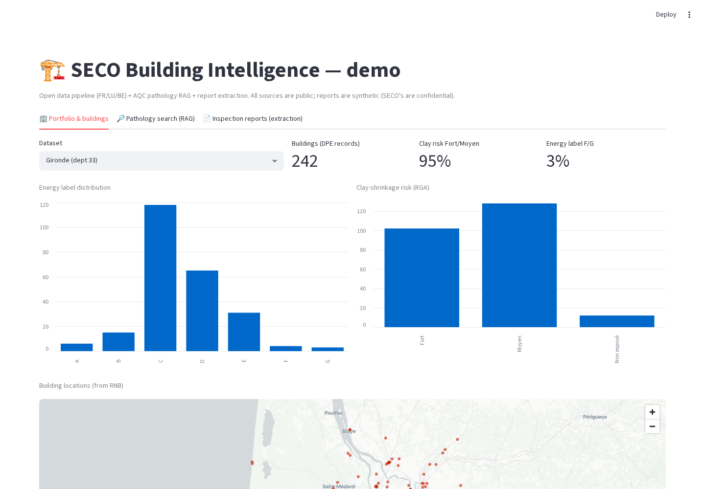
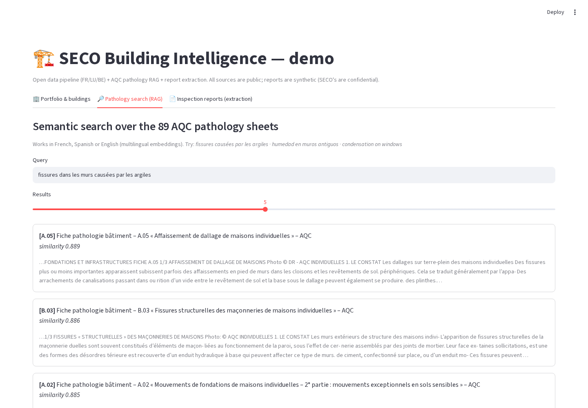
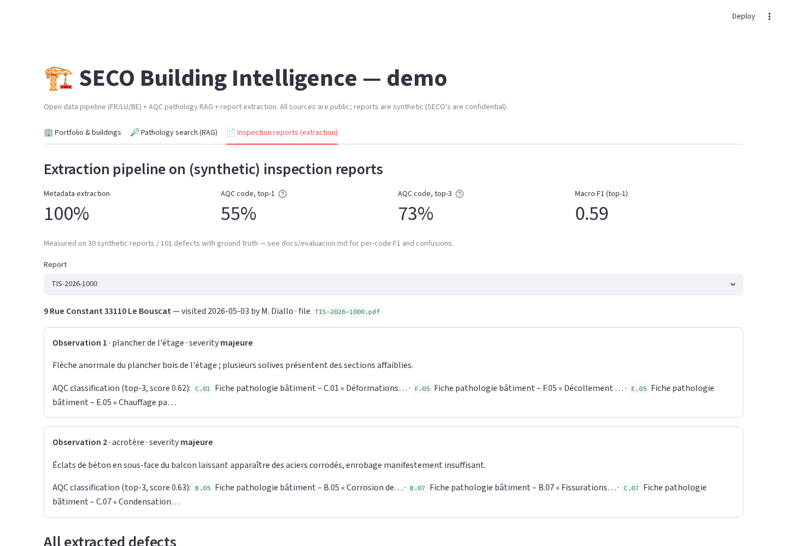
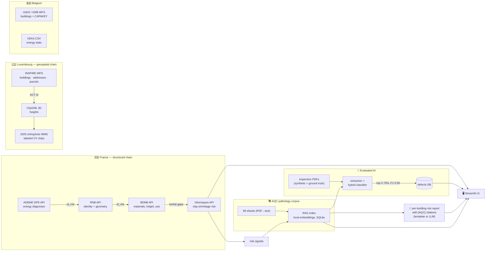

# SECO Building Intelligence — Pathology & Risk Copilot


A mini "Building Intelligence" product that turns **public building data and
inspection documents into actionable pathology-and-risk intelligence** for
technical inspectors and decennial-insurance risk analysts.

Built for the SECO challenge (`docs/research/brief.md`): data pipeline +
AI component + UI, on public, reproducible data only.

```bash
# One command to see it (after the setup below):
.venv/bin/streamlit run app.py
```

## Demo

**▶ Live app:**
<https://seco-building-intelligence-dtu3usrr6i5whv8s4cty5h.streamlit.app/>
*(first load takes a minute: the embeddings model is downloaded and cached)*

| Portfolio & buildings | Pathology search (RAG) | Report extraction |
|---|---|---|
|  |  |  |

*Left: enriched portfolio with KPIs, distributions and map; per-building risk
reports on demand. Center: multilingual semantic search over the 89 AQC
pathology sheets with citations. Right: defects extracted from inspection
PDFs, classified to the AQC taxonomy — evaluation metrics shown up front.*

## How it works



---

## 1. What problem, and for whom?

**User:** the technical inspector (contrôle technique) and the risk analyst
of a decennial insurer — SECO's daily actors.

**Problem:** the knowledge that decides a building's risk lives in two
disconnected places. (a) Decades of inspection reports sit in unstructured
PDFs that cannot be searched, aggregated or compared — the FHWA calls it the
*"mountain of inspection data"* problem, and it is the pain SECO's own brief
opens with. (b) The public context that explains and quantifies those risks
(energy performance, construction materials, geotechnical exposure, pathology
statistics) is scattered across a dozen heterogeneous portals in three
countries and four languages.

**What the product does:** it closes that loop end-to-end —

1. **Structured building identity card** from public data: for any French
   building, energy diagnosis + geometry + materials/height/use + clay-
   shrinkage risk, chained across 4 government APIs; equivalent geospatial
   chains for Luxembourg (incl. 3D heights and orthophoto) and Belgium
   (incl. the national cadastral key).
2. **Report extraction**: inspection PDFs → metadata + defect observations →
   each observation classified against the 89-sheet AQC pathology taxonomy
   (the French reference for decennial claims), with measured accuracy.
3. **Pathology RAG**: multilingual semantic search (FR/ES/EN) over the AQC
   corpus, with citations.
4. **Risk report generator**: building attributes become risk signals; each
   signal retrieves the pathology sheets that explain it; the output is a
   per-building report with citations (template mode, or LLM drafting via
   the Anthropic SDK).
5. **UI** (Streamlit): portfolio dashboard with map and filters, semantic
   search, and the extraction demo with its metrics displayed up front.

## 2. Why is this relevant to SECO?

- It targets SECO's **core data problem** (unstructured report archives) and
  its **core business** (technical control tied to decennial insurance: the
  AQC taxonomy used here is the one decennial claims are classified with).
- Every capability is **assistance with a human in the loop** — the
  classifier proposes top-3 candidates, the inspector validates — which keeps
  the product in the low-risk lane of the EU AI Act.
- The public-data backbone is exactly SECO's home turf: **France, Luxembourg,
  Belgium**, in French and Dutch. Nobody occupies this niche (US tools like
  UpCodes do code compliance, not European pathology/claims intelligence).
- With SECO's real archives (which this demo replaces with synthetic reports
  + public statistics), the same pipeline becomes a portfolio-wide defect
  intelligence platform — the product its CEO has publicly hinted at.

## 3. Data sources, and why

| Source | What it provides | Why it was chosen |
|---|---|---|
| ADEME DPE (FR) | 15M energy diagnoses, REST API | Richest open per-building data in Europe; carries the `id_rnb` join key |
| RNB (FR) | National building registry | The pivot ID that chains everything; geometry + status |
| BDNB / CSTB (FR) | Materials, height, floors, use, clay risk | The "identity card" attributes; built for exactly this use |
| Géorisques (BRGM) | Clay-shrinkage exposure by coordinate | The #1 decennial pathology driver (≈64% of claims are water/clay related per AQC) |
| geoportail.lu + data.public.lu (LU) | Cadastre, addresses, 3D CityGML heights, 10 cm orthophoto | SECO Luxembourg's home market; CC0 |
| UrbIS + GRB + VEKA (BE) | Buildings, parcels (CAPAKEY), energy stats | SECO's HQ market; CAPAKEY is the Belgian join key |
| AQC Fiches Pathologie (FR) | 89 pathology sheets | The reference taxonomy + the RAG knowledge base |

All sources are open-licensed (Licence Ouverte / CC0 / Flemish open licenses)
and were **verified live** — including several undocumented traps (silent
10-row cap on the BDNB API, a WAF-blocked portal whose files still download,
a migrated GeoServer found via a hidden GeoNetwork). Details and 17 findings:
[`docs/PIPELINE.md`](docs/PIPELINE.md); methodology (extraction,
normalization, joins): [`docs/METHODOLOGY.md`](docs/METHODOLOGY.md).

**Inspection reports are synthetic** (SECO's are confidential): 30 PDFs in 3
layouts, with real addresses from the pipeline and defect observations
written in free inspector French — plus a ground truth file, so the AI can be
*measured*, not just demoed.

## 4. AI component and its evaluation

Two AI pieces, both running **100% locally** (multilingual-e5-small
embeddings, MIT license — no API keys needed):

- **Semantic classification of defect observations** to the 89-class AQC
  taxonomy, using a hybrid scorer (embeddings 0.7 + TF-IDF 0.3 over cleaned
  per-sheet profiles).
- **RAG retrieval** for search and for grounding risk reports, with
  citations (sheet code + similarity score) on every output.

Measured against ground truth (`docs/evaluacion.md`):

| Metric | Result |
|---|---|
| Report metadata (ref, date, address, inspector) | **100%** |
| Observation segmentation, severity, location | **100%** |
| AQC code, top-1 (89 classes) | 55.4% |
| AQC code, **top-3** (the product metric — inspector picks from 3) | **73.3%** |
| Macro F1 (top-1) | 0.59 |

Honest limits: top-1 errors are dominated by *sibling sheets* of the taxonomy
(A.01/A.02 are two halves of the same phenomenon), which is why the UI shows
top-3 for validation; the naive approach scored 19.8% and a larger model
scored *worse* — the hybrid was chosen by experiment, and the iteration is
documented. An optional `--llm` mode drafts narrative reports through any of
three providers — `anthropic` (Claude, official SDK), `gemini` (AI Studio
free tier) or `openrouter` (free `:free` models) — selected with
`--llm <provider>` and `--modelo <model>`; the pipeline itself never
requires an LLM.

## 5. Technical decisions and trade-offs

| Decision | Why | Trade-off accepted |
|---|---|---|
| **Streamlit** over React | Solo build, finished MVP > half-broken ambition (the brief's own advice); Python-native, tested via AppTest | Less customizable; a React front would be the production path (SECO's stack) |
| **SQLite everywhere** (data, vectors, defects DB) | Zero infra, ships inside the repo, reproducible | No concurrency/scale; production would be PostgreSQL + pgvector |
| **Local embeddings, no LLM in the loop** | Reproducible without keys/cost; embeddings beat VLMs for this task at this scale | Lower ceiling than a hosted LLM extractor; `--llm` mode exists as the upgrade path |
| **Pure-stdlib ingestion scripts** | Auditable, no dependency wall for the data layer | Hand-rolled pagination/joins instead of a framework |
| **Synthetic reports with ground truth** | Only legal option; enables real metrics | Synthetic French is cleaner than scanned reality; OCR (docTR) is the known next step |
| **APIs over bulk downloads** | Right size for an MVP; proves the integration | Production volume needs the bulk GPKG/dump route (documented) |

## 6. Production tomorrow vs. throw away

**Ship tomorrow:** the four ingestion chains (FR/LU/BE) and their join keys;
the AQC corpus + RAG index; the risk-signal → citation engine; the evaluation
harness (the most reusable asset: any future extractor gets measured against
the same ground truth).

**Throw away / replace:** the Streamlit UI (→ React + FastAPI); SQLite (→
PostgreSQL + pgvector); the regex metadata parser (→ docTR/LLM extraction for
scanned, messy real PDFs); the hand-tuned hybrid weights (→ learned reranker
once real labeled data exists).

## 7. With 3 more months

1. **Real data**: ingest SECO's report archive (OCR with docTR, LLM
   extraction with function calling), fine-tune the classifier on real
   labels — the public-data scaffolding stays identical.
2. **Portfolio intelligence**: defect trends per building/portfolio vs. the
   AQC national statistics (the Sycodés benchmark), alerts for high-risk
   combinations (e.g. clay Fort + pre-1975 + strip foundations).
3. **Address-level coverage**: join the 48–83% of DPEs without `id_rnb` by
   normalized address; Wallonia; Statbel/VEKA second-level joins via
   CAPAKEY/NIS.
4. **CV module**: the pipeline already produces labeled 10 cm orthophoto
   chips per building; train a roof-condition classifier (SDNET2018/METU
   transfer, both CC-BY) and inject detections as observations into the same
   defects DB.
5. **React UI + auth + traceability logs**, positioned as an EU-AI-Act-ready
   assistance tool (human validation, citations, decision logs).

## Repository guide

```
app.py                       # Streamlit UI (3 tabs)
ingest_*.py                  # 9 ingestion scripts (FR/LU/BE chains, corpus, orthophoto)
rag_aqc.py                   # chunking + embeddings + semantic search
informe_edificio.py          # per-building risk report generator
sintetizar_informes.py       # synthetic inspection reports + ground truth
extraer_informes.py          # PDF → structured defects DB (hybrid classifier)
evaluar_extraccion.py        # metrics vs ground truth
data/ corpus/ informes*/     # all outputs, shipped for reproducibility
docs/PIPELINE.md             # full technical documentation (17 findings, results)
docs/METODOLOGIA.md          # extraction/normalization/join methodology (ES)
docs/INVENTARIO.md           # data inventory (ES)
docs/evaluacion.md           # AI evaluation detail
docs/research/               # challenge brief + product research reports
```

## Setup & reproduce

```bash
make setup     # creates .venv and installs pinned dependencies
make ui        # launches the app — all demo data ships in the repo

# Regenerate any stage from scratch:
make pipeline-fr DEPT=33 LIMIT=500   # French chain (live APIs, stdlib only)
make corpus rag                      # AQC corpus + RAG index
make extract eval                    # synthetic reports -> extraction -> F1 metrics
make report LLM=gemini               # LLM-drafted risk report (needs GEMINI_API_KEY)
make help                            # all targets
```

(Python 3.10+; `pdftotext` from `poppler-utils` for corpus/report text
extraction.) Full per-stage commands and options:
[`docs/PIPELINE.md`](docs/PIPELINE.md). Spanish versions:
[`docs/PIPELINE.es.md`](docs/PIPELINE.es.md).
